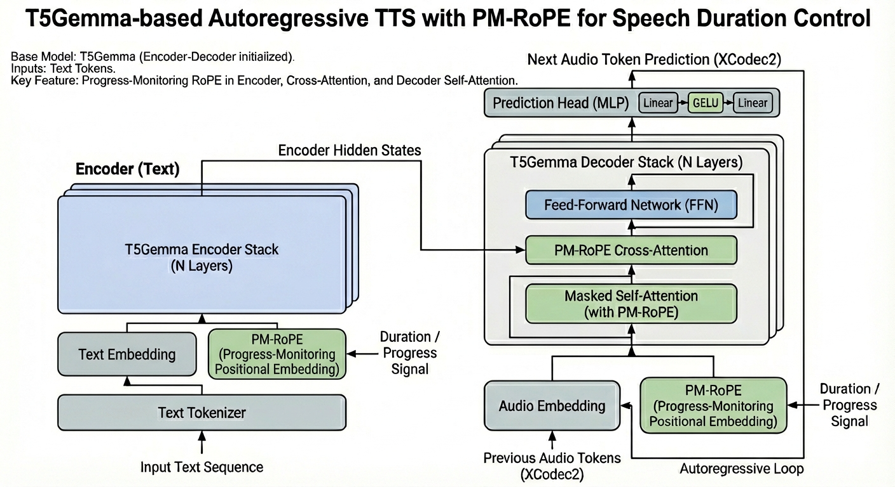

# T5Gemma-TTS

[](https://huggingface.co/Aratako/T5Gemma-TTS-2b-2b)
[](https://huggingface.co/spaces/Aratako/T5Gemma-TTS)
[](LICENSE)

**[日本語版 README はこちら](README_ja.md)**



Training and inference code for **T5Gemma-TTS**, a multilingual Text-to-Speech model based on the Encoder-Decoder LLM architecture. This repository provides scripts for data preprocessing, training (including LoRA fine-tuning), and inference.

For model details, audio samples, and technical information, please refer to the [model card](https://huggingface.co/Aratako/T5Gemma-TTS-2b-2b).

## Features

- **Multilingual TTS**: Supports English, Chinese, and Japanese
- **Voice Cloning**: Zero-shot voice cloning from reference audio
- **Duration Control**: Explicit control over generated audio length (auto-estimation when not specified)
- **Flexible Training**: Full training, fine-tuning, and LoRA fine-tuning support
- **Multiple Inference Options**: Command-line, HuggingFace format, and Gradio UI

## Installation

```bash
git clone https://github.com/Aratako/T5Gemma-TTS.git
cd T5Gemma-TTS
pip install -r requirements.txt
```

**Note**: For GPU support, install PyTorch with CUDA before running `pip install`:
```bash
pip install torch torchaudio --index-url https://download.pytorch.org/whl/cu128
```

## Quick Start

### Basic Inference (HuggingFace Format)

```bash
python inference_commandline_hf.py \
    --model_dir Aratako/T5Gemma-TTS-2b-2b \
    --target_text "Hello, this is a test of the text to speech system."
```

### Voice Cloning

```bash
python inference_commandline_hf.py \
    --model_dir Aratako/T5Gemma-TTS-2b-2b \
    --target_text "Hello, this is a test of the text to speech system." \
    --reference_text "This is a reference." \
    --reference_speech path/to/reference.wav
```

### Duration Control

```bash
# Specify target duration in seconds
python inference_commandline_hf.py \
    --model_dir Aratako/T5Gemma-TTS-2b-2b \
    --target_text "Hello, this is a test of the text to speech system." \
    --target_duration 5.0
```

**Note**: If `--target_duration` is not specified, the model automatically estimates an appropriate duration based on phoneme analysis.

## Inference

### Using HuggingFace Format

```bash
python inference_commandline_hf.py \
    --model_dir Aratako/T5Gemma-TTS-2b-2b \
    --target_text "The quick brown fox jumps over the lazy dog." \
    --output_dir ./generated_tts
```

### Using .pth Checkpoint

```bash
python inference_commandline.py \
    --model_root . \
    --model_name trained \
    --target_text "The quick brown fox jumps over the lazy dog."
```

For LoRA checkpoints:

```bash
python inference_commandline.py \
    --model_root . \
    --model_name lora \
    --target_text "The quick brown fox jumps over the lazy dog."
```

### Gradio Web UI

```bash
python inference_gradio.py \
    --model_dir Aratako/T5Gemma-TTS-2b-2b \
    --port 7860
```

By default, XCodec2-Variant (NandemoGHS/Anime-XCodec2-44.1kHz-v2) is used for audio decoding to better support Japanese voices. For English and Chinese voices, I recommend using the original XCodec2 model.

```bash
# You must use the original xcodec2 library when using the original XCodec2 model
pip install xcodec2==0.1.5 --no-deps

python inference_gradio.py \
    --model_dir t5gemma_voice_hf \
    --xcodec2_model_name HKUSTAudio/xcodec2 \
    --xcodec2_sample_rate 16000 \
    --port 7860
```

### Inference Parameters

| Parameter | Default | Description |
|-----------|---------|-------------|
| `--target_text` | (required) | Text to synthesize |
| `--reference_speech` | None | Path to reference audio for voice cloning |
| `--reference_text` | None | Transcript of reference audio (auto-transcribed via Whisper if not provided) |
| `--target_duration` | None | Target audio duration in seconds (auto-estimated if not provided) |
| `--top_k` | 30 | Top-k sampling parameter |
| `--top_p` | 0.9 | Top-p (nucleus) sampling parameter |
| `--temperature` | 0.8 | Sampling temperature |
| `--seed` | 1 | Random seed for reproducibility |

## Training

### Data Preprocessing

Prepare training data using the preprocessing scripts. Example with Emilia-YODAS English subset:

```bash
python examples/data_preprocess/prepare_emilia_en.py \
    --output-dir datasets/emilia-yodas-en_0-9 \
    --data-files '{"train": "Emilia-YODAS/**/EN-B000000.tar"}' \
    --encoder-devices auto \
    --valid-ratio 0.005 \
    --hf-num-proc 8
```

This generates:
- `text/` - Text transcripts
- `xcodec2_1cb/` - XCodec2 audio tokens
- `manifest_final/` - Train/validation manifests
- `neighbors/` - Neighbor files for voice prompting

### Training from Scratch

```bash
NUM_GPUS=8 examples/training/t5gemma_2b-2b.sh
```

### Fine-tuning a Pretrained Model

Full fine-tuning:

```bash
NUM_GPUS=8 examples/training/t5gemma_2b-2b-ft.sh
```

LoRA fine-tuning:

```bash
NUM_GPUS=1 examples/training/t5gemma_2b-2b-ft-lora.sh
```

### Training Configuration

Key training parameters (see training scripts for full configuration):

| Parameter | Description |
|-----------|-------------|
| `--t5gemma_model_name` | Base T5Gemma model (e.g., `google/t5gemma-2b-2b-ul2`) |
| `--xcodec2_model_name` | Audio codec model |
| `--lr` | Learning rate (default: 0.035 for ScaledAdam) |
| `--gradient_accumulation_steps` | Gradient accumulation steps |
| `--use_lora` | Enable LoRA training (1 to enable) |
| `--lora_rank` | LoRA rank (default: 8) |

## Model Conversion

### Convert .pth to HuggingFace Format

Standard checkpoint:

```bash
python scripts/export_t5gemma_voice_hf.py \
    --ckpt trained.pth \
    --out t5gemma_voice_hf \
    --base_repo google/t5gemma-2b-2b-ul2
```

LoRA checkpoint (merge adapters):

```bash
python scripts/export_t5gemma_voice_hf_lora.py \
    --ckpt lora.pth \
    --out t5gemma_voice_hf_lora_merged \
    --base_repo google/t5gemma-2b-2b-ul2 \
    --save_adapter_dir lora-adapter
```

## Project Structure

```
T5Gemma-TTS/
├── main.py                      # Training entry point
├── inference_commandline.py     # CLI inference (.pth format)
├── inference_commandline_hf.py  # CLI inference (HuggingFace format)
├── inference_gradio.py          # Gradio web demo
├── config.py                    # Configuration and arguments
├── requirements.txt             # Dependencies
│
├── models/                      # Model architecture
│   └── t5gemma.py               # T5GemmaVoiceModel with PM-RoPE
│
├── data/                        # Data loading
│   ├── combined_dataset.py      # Multi-dataset loader
│   └── tokenizer.py             # AudioTokenizer (XCodec2)
│
├── steps/                       # Training infrastructure
│   ├── trainer.py               # Distributed trainer
│   └── optim.py                 # ScaledAdam optimizer
│
├── scripts/                     # Utility scripts
│   ├── export_t5gemma_voice_hf.py      # Export to HF format
│   └── export_t5gemma_voice_hf_lora.py # Export LoRA to HF format
│
├── hf_export/                   # HuggingFace model wrapper
│   ├── configuration_t5gemma_voice.py
│   └── modeling_t5gemma_voice.py
│
└── examples/
    ├── training/                # Training shell scripts
    │   ├── t5gemma_2b-2b.sh           # Train from scratch
    │   ├── t5gemma_2b-2b-ft.sh        # Full fine-tuning
    │   └── t5gemma_2b-2b-ft-lora.sh   # LoRA fine-tuning
    └── data_preprocess/         # Data preprocessing
        └── prepare_emilia_en.py       # Emilia English preparation
```

## Limitations

- **Inference Speed**: The model is not optimized for real-time TTS applications. Autoregressive generation of audio tokens takes significant time, making it unsuitable for low-latency use cases.
- **Duration Control**: While the model supports explicit duration specification, control is not perfect. Generated audio may differ from the specified duration, and even when the duration matches, the speech pacing or naturalness may not always be optimal.
- **Audio Quality**: Quality depends on training data characteristics. Performance may vary for voices, accents, or speaking styles underrepresented in the training data.

## License

- **Code**: [MIT License](LICENSE)
- **Model Weights**: Please refer to the [model card](https://huggingface.co/Aratako/T5Gemma-TTS-2b-2b) for licensing details

## Acknowledgments

This project builds upon the following works:

- [VoiceStar](https://arxiv.org/abs/2505.19462) - Architecture inspiration and base code
- [T5Gemma](https://huggingface.co/google/t5gemma-2b-2b-ul2) - Base model
- [XCodec2](https://huggingface.co/HKUSTAudio/xcodec2) and [XCodec2-Variant](https://huggingface.co/NandemoGHS/Anime-XCodec2-44.1kHz-v2) - Audio codec

## Citation

```bibtex
@misc{t5gemma-tts,
  author = {Aratako},
  title = {T5Gemma-TTS: An Encoder-Decoder LLM-based TTS Model},
  year = {2025},
  publisher = {GitHub},
  journal = {GitHub repository},
  howpublished = {\url{https://github.com/Aratako/T5Gemma-TTS}}
}
```
